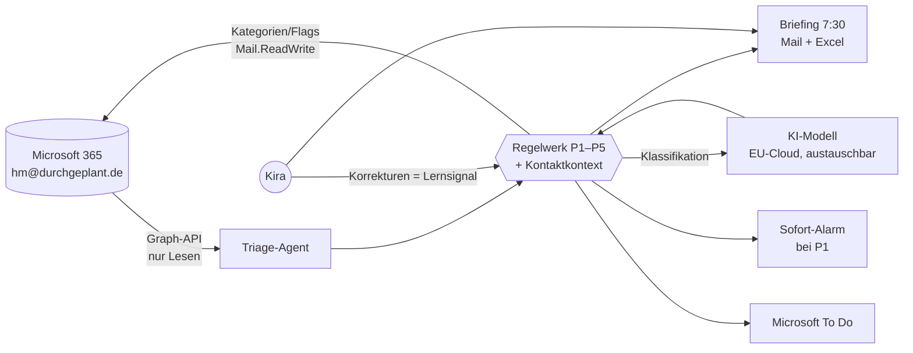

# 04-design.md — Phase 3: Design des Piloten (Stand 16.07.2026)

Pilot: **Lesen + Kategorien** auf **hm@durchgeplant.de**. KI: **EU-Cloud** (Kandidat 1: Claude mit EU-Datenresidenz; Alternativen: Azure OpenAI EU, Mistral). Modell austauschbar.

---

## 1. Prioritäts-Regelwerk (bitte korrigieren!)

Regel vor Gefühl. Reihenfolge der Prüfung: **Absenderrolle → Frist/Geld → Signalwörter → Tonfall.**

| Stufe | Wer / Was | Beispiel | Reaktion |
|---|---|---|---|
| **P1 — Sofort-Alarm** | Interessent mit Kaufsignal | „Was kostet …?", „Vertrag?", Besichtigungswunsch | Push sofort |
| | Bestandskunde mit Problem/Eskalation | „läuft schief", Unzufriedenheit, Baustopp | Push sofort |
| | Harte Signalwörter | Mahnung · Frist ≤ 48 h · Havarie · Kündigung/Anwalt | Push sofort |
| **P2 — Heute** | Kundenfrage (normal) · Behörde · Bank/Recht | Rückfrage, Bescheid, Finanzierung | Briefing oben |
| **P3 — Diese Woche** | Frist > 48 h · Rechnung/BWA · Partner organisatorisch | Skonto-Frist, Monatsrechnung | Briefing Mitte |
| **P4 — Zur Kenntnis** | CC · Info ohne Handlung | Protokolle, Bestätigungen | Briefing kurz |
| **P5 — Rauschen** | Werbung · Newsletter | — | 3-Zeilen-Sammelblock, nie gelöscht |

**Feste Zusatzregeln:**
- **Neue Interessenten-Anfrage → immer P1, ohne Ausnahme** (vom Kunden am 24.07. bestätigt: „immer wichtig"). 
- **Aus Testrunde 2:** Einladungen mit Termin an den Inhaber → P2 · Rückrufbitten → P2 · wiederkehrende Abo-/Dauerrechnungen bekannter Anbieter → P4.
- Unbekannter Absender + Objekt-/Projektfrage → wie Interessent behandeln (P1).
- Unsicherheit → **eine Stufe höher.** Precision wird geopfert, Recall geschützt.
- Rechnung/BWA zum Monats-/Quartalsende **ausgeblieben** → eigener Hinweis im Briefing.

## 2. Briefing (täglich 7:30 Uhr, Mail + Excel)

Aufbau — pro Eintrag genau: 1 Satz Kern · Frist · dein nächster Schritt · Link zur Mail.

> **HEUTE (2)**
> 🔴 Fam. Berger (Interessent): fragt nach Preis Objekt Ahornweg. Frist: — . Nächster Schritt: anrufen. [Mail]
> 🔴 Hr. Klein (Kunde): unzufrieden, Estrich-Verzug. Nächster Schritt: Rückruf heute. [Mail]
> **DIESE WOCHE (3)** …
> **ZUR KENNTNIS (4)** …
> **RAUSCHEN:** 11 Mails — Werbung Baustoffe, 2 Newsletter. Nichts Auffälliges.

Lesezeit-Ziel: **unter 5 Minuten.** Excel-Anhang: gleiche Einträge als Liste (filterbar).

## 3. Todos & Kategorien

- Aufgaben aus P1/P2 → **Microsoft To Do** („Rückruf Fam. Berger, heute"). Keine neue Insel.
- Kategorien in Outlook: 🔴 Sofort · 🟢 Interessent · 🔵 Rechnung/Finanzen · 🟣 Behörde. Korrektur durch Kira = Lernsignal.

## 4. Kontaktkontext (minimaler Speicher)

Je Kontakt nur: Name · Rolle (Kunde/Interessent/Partner/Behörde) · Firma/Postfach · Projekt · letzter Stand (1 Satz) · Anrede (Du/Sie).
Quelle: ausschließlich belegte Fakten aus Mails. Speicherort: verschlüsselte Datei im Projektordner, nicht beim KI-Anbieter.

## 5. Entwürfe (Stufe 2 — vorgesehen, separate Freigabe)

- Ton **kundenabhängig** (aus Kontaktkontext), Signatur + Absender strikt je Firma.
- **Nie entwerfen:** Preise/Angebote/Nachträge · Zusagen · Termine ohne Kalenderabgleich · Rechtswirksames.
  Stattdessen Markierung: „Selbst formulieren."
- Entwurf landet nur im Entwürfe-Ordner der richtigen Firma. Senden bleibt bei Kira.

## 6. Fehlermodi & Guardrails

| Fehlermodus | Guardrail |
|---|---|
| Wichtiges als Rauschen | Asymmetrie-Regel + nichts löschen + Test an 100 Mails (Phase 4) |
| Prompt Injection (Mail enthält Befehle an die KI) | Mailinhalt ist immer Daten, nie Instruktion; Rechte: nur Lesen/Kategorien — Senden technisch unmöglich |
| Modell erfindet Projektstand | Briefing nur mit Mail-Link je Aussage; Kontext nur aus belegten Mails |
| Entwurf versehentlich gesendet | Stufe 2: Senden technisch bei Kira; Entwürfe sichtbar markiert; Tabu-Liste |

## 7. Architektur (Schaubild)

---

**STOPP — zur Abnahme:** Bitte das Regelwerk in Abschnitt 1 prüfen (Stufen, Beispiele, Zusatzregeln). Danach Phase 4: Test an 100 alten Mails.
