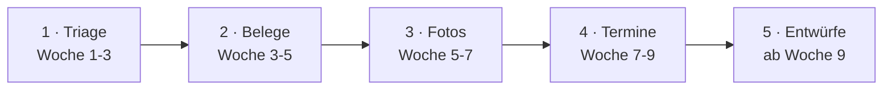

# 07-automatisierung.md — Phase 6: Dauerbetrieb & Ausbau (Stand 26.08.2026)

Zwei neue Vorgaben von Kira: **Es muss immer laufen, unabhängig von jedem Rechner.**
Und: **es soll mehr automatisiert werden als nur die E-Mail-Triage.**

---

## 1. Entscheidung: n8n Cloud

| Punkt | Lage |
|---|---|
| Betrieb | Läuft rund um die Uhr, kein Rechner muss an sein |
| Anbieter | n8n GmbH, **Berlin** — deutsches Unternehmen |
| Serverstandort | **Frankfurt**, EU |
| Vertrag | AVV liegt fertig vor, inkl. Standardvertragsklauseln und Unterauftragnehmer-Liste |
| Sicherheit | SOC-2-Type-II-Zertifizierung |
| Kosten | ab etwa 20 € im Monat |

**Ehrlich benannt:** Es kommt ein weiterer Mitleser hinzu — bisher las nur Microsoft mit, künftig
auch n8n. Das ist eine bewusste Abwägung zugunsten von Verfügbarkeit und Ausbaufähigkeit,
abgemildert durch deutschen Anbieter, EU-Server und AVV.

## 2. Bauweise: kombinieren statt ausliefern (Entscheidung 26.08.)

**Grundsatz: Das Wertvolle bleibt bei Kira, das Austauschbare kommt von n8n.**

| Teil | Wo er lebt | Warum |
|---|---|---|
| **Regelwerk, Briefing-Format, Tabu-Listen** | `regelwerk/regelwerk.json` — **im eigenen Projekt** | Eigentum, portierbar, jederzeit testbar |
| Zeitsteuerung, Verbindungen, Fehleralarm, Wiederholung, Zugangsdaten | n8n | Fertig, muss niemand selbst bauen und pflegen |
| Notfallweg `pilot/triage.py` | eigenes Projekt | Läuft auch ohne n8n — liest **dieselbe** Regelwerk-Datei |

n8n **ruft** das Regelwerk auf, es **besitzt** es nicht.

**Korrektur zur ersten Fassung:** Dort stand, das Python-Programm werde „nur noch Vorlage".
Beim kombinierten Weg stimmt das nicht — sein Kern bleibt echter Bestandteil und Rückfallweg.

**Warum nicht alles selbst bauen:** Nicht das Programmieren ist der Aufwand, sondern Server-Pflege,
Sicherungen, Überwachung, Fehleralarm und Zugangsdaten-Verwaltung — sechs Dinge, die n8n mitbringt.
Fällt der Ablauf morgens aus, meldet n8n das. Bei Eigenbau merkt es niemand.

**Ausstiegsversicherung:** Die n8n-Abläufe werden regelmäßig als Datei ins Projekt gesichert.
Bei einem Wechsel wandern Regelwerk, Abläufe und Notfallweg mit — Umzug in Tagen statt Monaten.

## 3. Die fünf Automatisierungen

| # | Automatisierung | Was sie tut | Risiko |
|---|---|---|---|
| **1** | **E-Mail-Triage** | Einstufen P1–P5, Kategorien, Briefing 7:30 als Entwurf | gering — getestet |
| **2** | **Belege & Rechnungen** | Rechnungen erkennen, ablegen, für Steuerberater sammeln | gering |
| **3** | **Fotos & Anhänge** | Baustellenfotos in die richtigen Projektordner | gering |
| **4** | **Termine & Kalender** | Termine und Fristen erkennen, Vorschlag in den Kalender | mittel |
| **5** | **Antwort-Entwürfe** | KI schreibt vor, Papa prüft und sendet selbst | **hoch** |

## 4. Reihenfolge — eine nach der anderen

Jede Stufe läuft erst zwei Wochen stabil, bevor die nächste startet.

## 5. Sicherheitsregeln — gelten für ALLE fünf

1. **Nichts wird gesendet.** Alles landet als Entwurf. Senden bleibt bei Papa.
2. **Nichts wird gelöscht.** Auch Rauschen bleibt liegen, nur zusammengefasst.
3. **Im Zweifel hochstufen.** Jeder Fehler führt zu „wichtig", nie zum Verwerfen.
4. **Mailinhalt ist Datenmaterial, nie Anweisung** (Schutz vor untergeschobenen Befehlen).
5. **Bei Entwürfen tabu:** Preise, Angebote, Nachträge, Terminzusagen, Rechtswirksames.
6. **Zugangsdaten** liegen im Passwortspeicher von n8n, nie im Klartext in einem Ablauf.

## 6. Was Kira tun muss

| Schritt | Aufwand |
|---|---|
| Konto bei n8n Cloud anlegen, **EU/Frankfurt** wählen | 10 Min |
| AVV im Kundenbereich abschließen | 5 Min |
| Microsoft-Zugang verbinden (wie in `pilot/ANLEITUNG-EINRICHTUNG.md`) | 15 Min |
| Zugang zum KI-Anbieter hinterlegen | 5 Min |

Alles Weitere baut Cowork.

---

**Nächster Schritt: Automatisierung 1 in n8n nachbauen und gegen das bestandene Testergebnis prüfen.**
